# Manual de instalación para Plugin OpenCart 3.x

## Descripción

Este plugin oficial ha sido creado para que puedas integrar Onepay fácilmente en tu comercio, basado en OpenCart 3.

## Requisitos

1. Debes tener instalado previamente Opencart 3

## Instalación del Plugin

1. Dirígete a [https://github.com/TransbankDevelopers/transbank-plugin-opencart-onepay/releases](https://github.com/TransbankDevelopers/transbank-plugin-opencart-onepay/releases) y descarga la última versión disponible del plugin.

  Una vez descargado el plugin, ingresa a la página de administración de Opencart (usualmente en http://misitio.com/admin, http://localhost/admin) y dirígete a Extensions / Installer, indicado a continuación:

  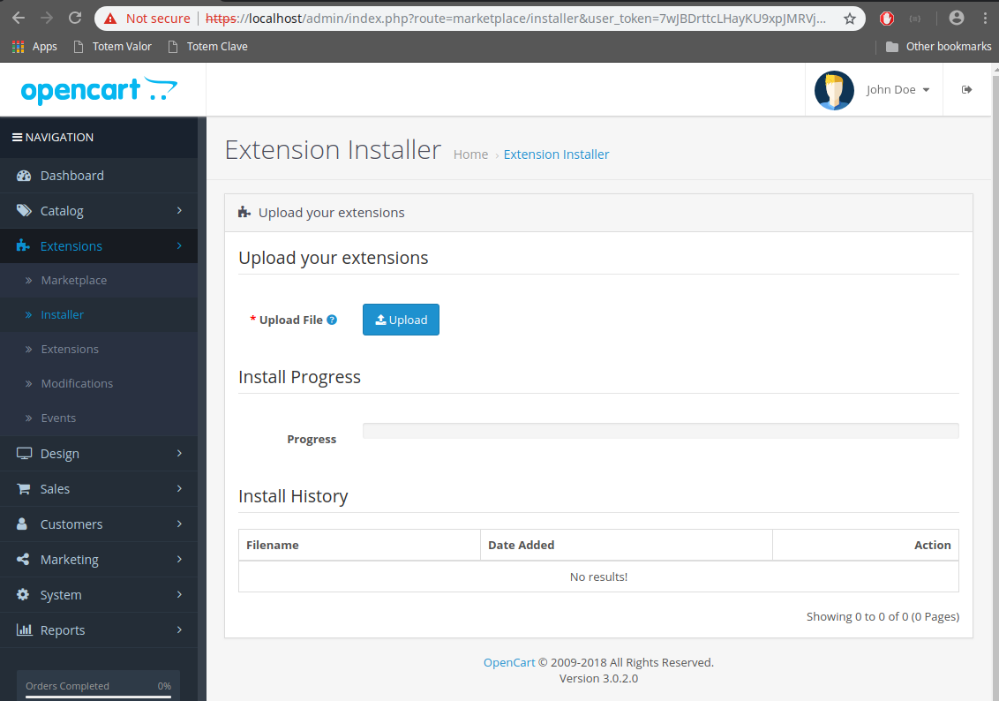
  
2. Haz click sobre el botón "Upload" y selecciona el archivo que descargaste en el paso anterior. Al instalar aparecerá que fue instalado exitosamente.

  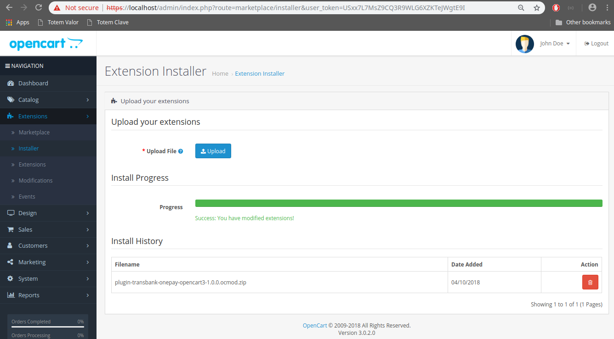

## Configuración

Este plugin posee un sitio de configuración que te permitirá ingresar credenciales que Transbank te otorgará y además podrás generar un documento de diagnóstico en caso que Transbank te lo pida.

Para acceder a la configuración, debes seguir los siguientes pasos:

1. Dirígete a la página de administración de Opencart (usualmente en http://misitio.com/admin, http://localhost/admin) e ingresa usuario y clave.

2. Dentro del sitio de administración dirígete a (Extensions / Extensions) y filtra por "Payments".

  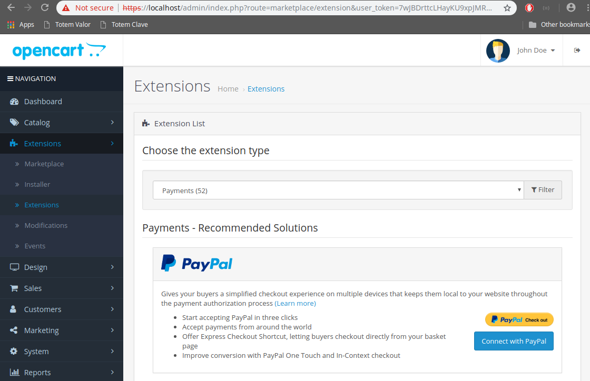

3. Busca hacia abajo el plugin "Transbank Onepay".

  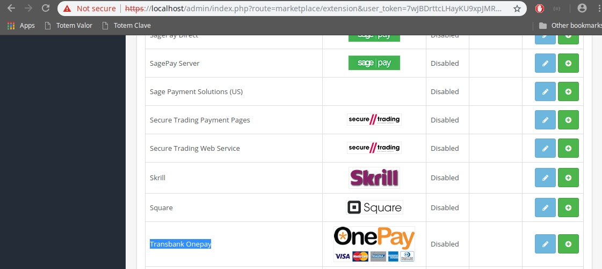

4. Presiona el botón verde "+" para instalar el plugin.
   
  

5. Cambiará a color rojo.

  

6. Presiona el botón para editar el plugin

7. ¡Ya está! Estás en la pantalla de configuración del plugin, debes ingresar la siguiente información:
  * **Estado**: Al activarlo, Onepay estará disponible como medio de pago. Ten la precaución de que se encuentre seleccionada esta opción cuando quieras que los usuarios paguen con Onepay.
  * **Endpoint**: Ambiente hacia donde se realiza la transacción. 
  * **APIKey**: Es lo que te identifica como comercio.
  * **Shared Secret**: Llave secreta que te autoriza y valida a hacer transacciones.
  
  Las opciones disponibles para _Endpoint_ son: "Integración" para realizar pruebas y certificar la instalación con Transbank, y "Producción" para hacer transacciones reales una vez que Transbank ha aprobado el comercio. Dependiendo de cual Endpoint se ha seleccionado el plugin usará uno de los dos set de APIKey y Shared Secret según corresponda. 
  
### Credenciales de Prueba

Para el ambiente de Integración, puedes utilizar las siguientes credenciales para realizar pruebas:

* APIKey: `dKVhq1WGt_XapIYirTXNyUKoWTDFfxaEV63-O5jcsdw`
* Shared Secret: `?XW#WOLG##FBAGEAYSNQ5APD#JF@$AYZ`

7. Guardar los cambios presionando el botón 
   
  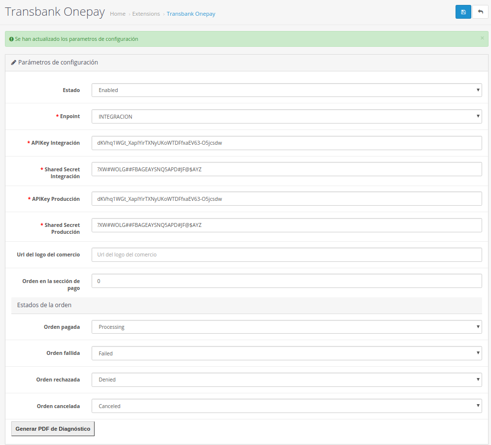

8. Además, puedes generar un documento de diagnóstico en caso que Transbank te lo pida. Para ello, haz click en "Generar PDF de Diagnóstico" y automáticamente se descargará dicho documento.

  

## Prueba de instalación con transacción

En ambiente de integración es posible realizar una prueba de transacción utilizando un emulador de pagos online.

* Ingresa al comercio

  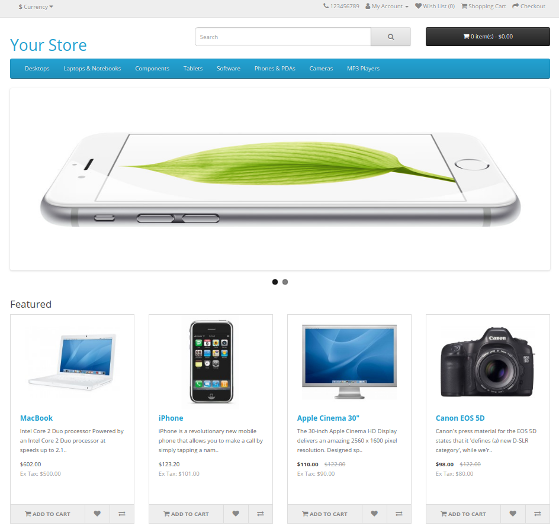

* Ya con la sesión iniciada, ingresa a cualquier sección para agregar productos

  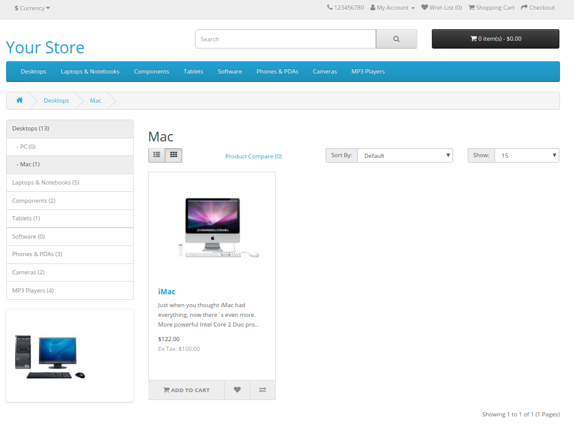

* Agrega al carro de compras un producto:

  

* Selecciona el carro de compras y luego presiona el botón [Checkout]:

  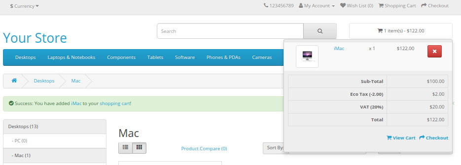

* Ingresa los datos que te pida como dirección, método de envío y luego selecciona método de pago Transbank Onepay, luego presiona el botón [Continue]

  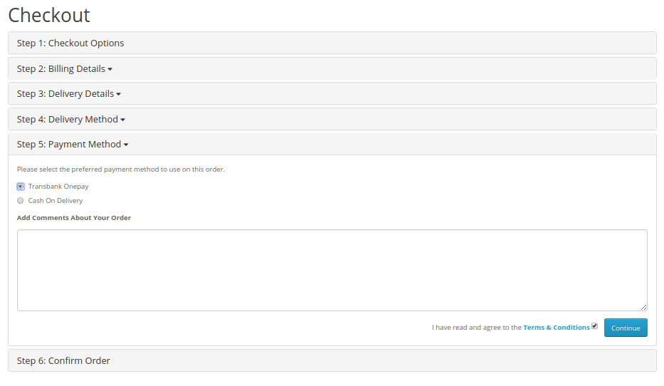

* Luego presiona el botón [Confirm Order]

  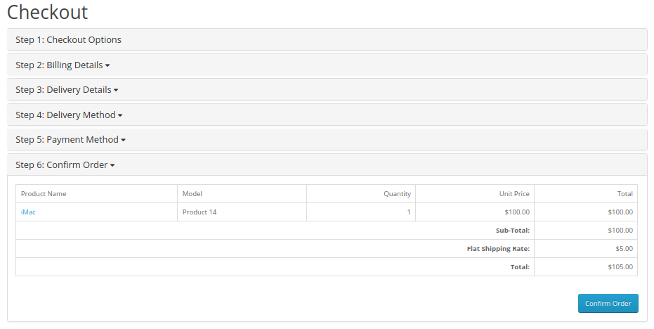

* Una vez presionado el botón para iniciar la compra, se mostrará la ventana de pago Onepay, tal como se ve en la imagen. Toma nota del número que aparece como "Código de compra", ya que lo necesitarás para emular el pago en el siguiente paso (En este ejemplo 8660 - 7579):
  
  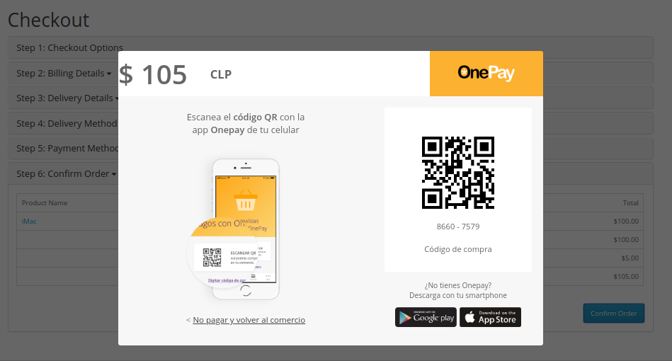
  
* En otra ventana del navegador, ingresa al emulador de pagos desde [https://onepay.ionix.cl/mobile-payment-emulator/](https://onepay.ionix.cl/mobile-payment-emulator/), utiliza test@onepay.cl como correo electrónico, y el código de compra obtenido desde la pantalla anterior. Una vez ingresado los datos solicitados, presiona el botón "Iniciar Pago":

  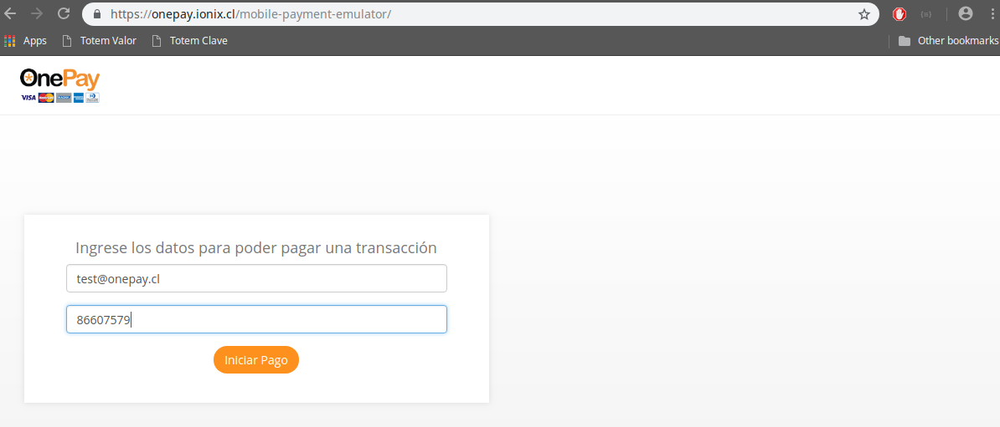
  
* Si todo va bien, el emulador mostrará opciones para simular situaciones distintas. Para simular un pago exitoso, presiona el botón `PRE_AUTHORIZED`. En caso de querer simular un pago fallido, presiona le botón `REJECTED`. Simularemos un pago exitóso presionando el botón `PRE_AUTHORIZED`.

  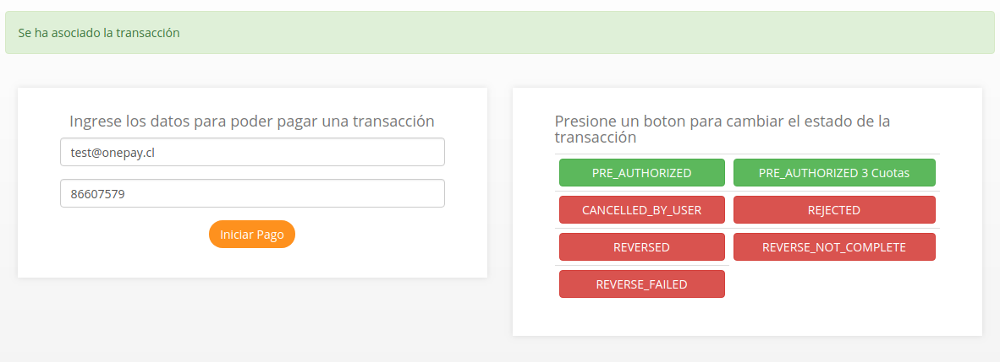
  
* Vuelve a la ventana del navegador donde se encuentra Opencart y podrás comprobar que el pago ha sido exitoso.

 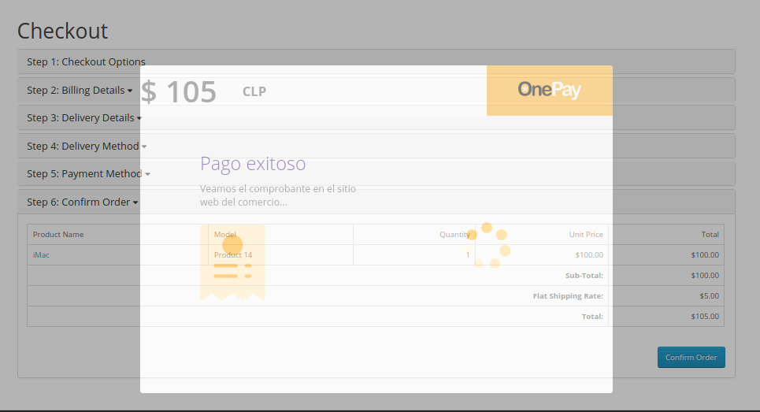

 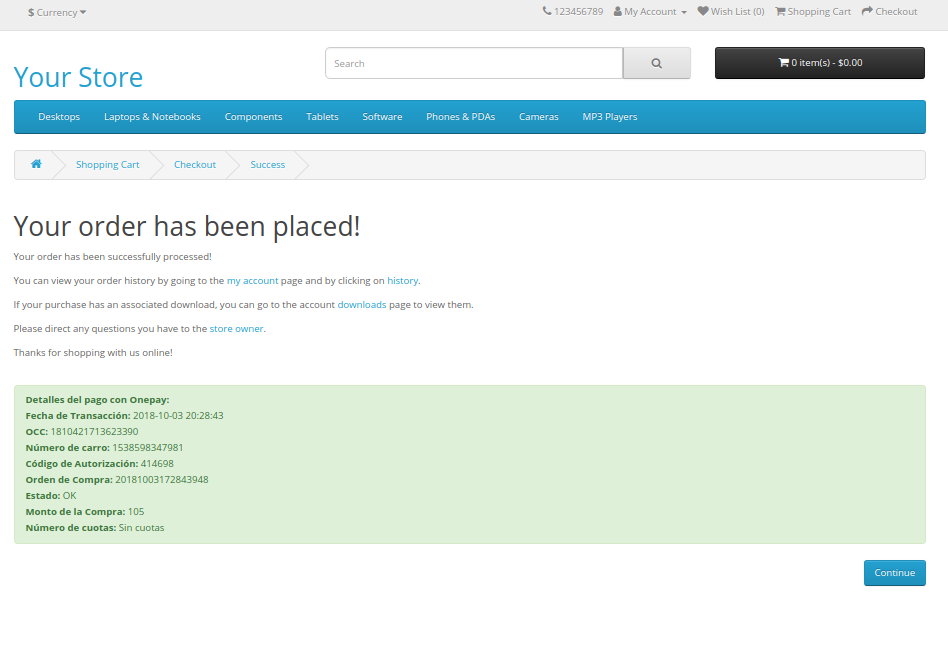

* Además si accedes al sitio de administración seccion (Sales / Ordes) se podrá ver la orden creada y el detalle de los datos entregados por Onepay.

 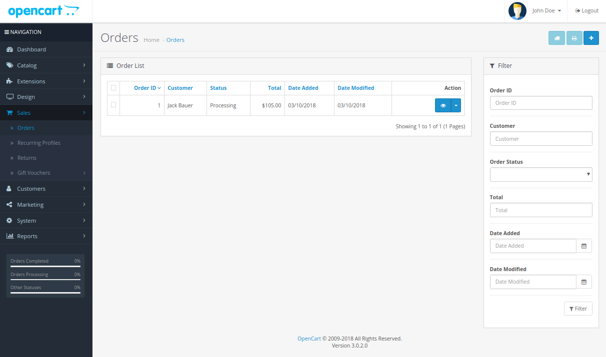

 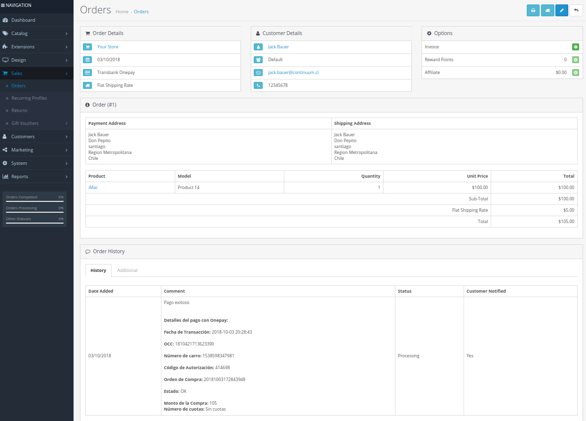
